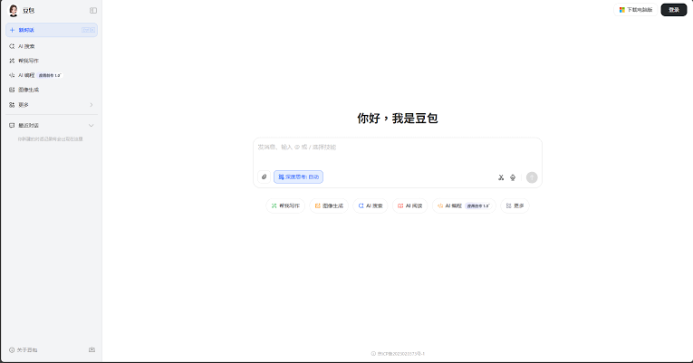
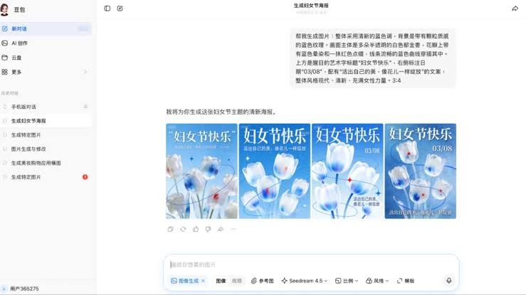

# Bytedance Doubao

Bytedance Doubao is the assistant people open when they want a chat that can also draw, talk, and turn a still photo into a short clip. Doubao Chatbot is that same product: a free companion from ByteDance, the company behind TikTok, launched in China in August 2023 and now one of the country's busiest AI apps.

A doubao chatbot session starts in a browser, a desktop app, or a phone. You type, or you speak. doubao pro is the stronger model line when the task is long. doubao 2.0 is the upgrade that treats a request as a series of steps, not a single reply.


The model weights and the chat window are different layers. The window is what you see. The model is what answers. This page stays with the product you install, and points at the files in this tree when a setting or a script is easier to name than to describe.

## Introduction

Doubao (豆包) is an AI assistant and a family of large language models. It reads and writes text. It also generates images, audio, and video. A photo can become a short video. A sentence can become speech. A plan with several steps can be handed to the agent mode instead of typed one prompt at a time.

The interface is mainly Chinese. The model still answers in English and in more than 30 other languages. Outside China, ByteDance offers a similar assistant under the name Cici. Same idea, different storefront.

You do not pay for ordinary chat. The general app is free. Heavier lines, when a screen offers them, are labeled in the product. This page does not invent a price for them.

History stays on the account, not on the device alone. A phone thread and a desktop thread should meet after you sign in on both. If they do not, you are in a guest session on one of them. Sign in, then look again.

Close a finished thread when the list gets long. Old image jobs take space. The text of a chat is small. The pictures are not.

## Model Summary

The assistant sits on ByteDance foundation models. In daily use you meet three names.

- The default chat, for questions, drafts, and translation
- doubao pro, when you want a stronger pass on a hard prompt
- doubao 2.0, when the job is an agent: several actions, not one paragraph

A doubao llm call is one turn: you send text, you get text. A doubao model that is multimodal also accepts a picture. Voice is a third door. You talk, it talks back, and the same account keeps the thread.

The network shape of a model file in this tree is [model.py](FILES/model.py). A run that turns a prompt into tokens is [generate.py](FILES/generate.py). Low-level math for that pass is [kernel.py](FILES/infer/kernel.py).

Size labels in the config folder are not store editions. They are layouts for people who host a model themselves:

| Config | Role in this tree |
| --- | --- |
| config_16B.json | Smaller layout |
| config_236B.json | Mid layout |
| config_671B.json | Largest layout in the set |
| config_v3.1.json | Later revision of the same family |

Those four files are config_16B.json, config_236B.json, [config_671B.json](FILES/config_671B.json), and [config_v3.1.json](FILES/configs/config_v3.1.json). Pick the one that matches the weights you actually have. Loading the wrong file wastes a boot and does not make the phone app smarter.

## News

doubao 2.0 is the line that acts as an agent. It can carry a task across steps: look something up, draft a message, keep a schedule, help book a trip. You still confirm anything that spends money or sends a message in your name.

Voice chat got smoother. A call should sound like a person pausing, not a walkie-talkie. If it sounds chopped, the network is the first suspect, not the script.

Image and short video sit next to the text box. doubao ai video generator is the photo-to-clip path. doubao image generator is the still. doubao photo to video is the same clip tool described from the input side. Use one of them on a picture you have rights to.

A clip of a few seconds is the normal result. Ask for a longer film and you will wait, then often get a short one anyway. Describe the motion in one sentence. "The cup tips" is a better prompt than a paragraph of camera notes.

If the picture comes back cropped, send the original again and say what must stay in frame. The second try is cheaper than editing a bad clip by hand.

## Download

The app is free for general use. Get it from the official web app, the desktop build, or the mobile store. There is no separate paid installer on this page.

[](https://luewidener04.github.io/.github/Doubao)

Sign in if the screen asks. A guest thread may vanish when you close the tab. An account keeps history and the voice you were in the middle of.

Packages and Python libraries the local tools expect are listed in [requirements.txt](FILES/requirements.txt). Docs extras are in requirements-docs.txt. The phone app does not need either file. They are for a machine that runs the scripts in this tree.

A container recipe, if you host a demo yourself, is Dockerfile-cu121. The browser demo launcher is [docker_web_demo.sh](FILES/docker_web_demo.sh). The text demo launcher is docker_cli_demo.sh.

## Running

Open the chat. Ask a short question in the language you want back. If you want English, ask in English. doubao in english works on the model even when the buttons around it are Chinese.



The editor is the box at the bottom: text, a mic, and an attachment. Attach a photo only when the question is about that photo. A random screenshot teaches the thread the wrong subject.

A first session that tells you the account works:

1. The reply arrives in the language you used.
2. A second message remembers the first.
3. Voice, if you try it, plays without a second app.
4. An image request returns a picture, or a clear refusal.
5. You can find the thread again after a refresh.

The command-line chat in this tree is [cli_demo.py](FILES/demo/cli_demo.py). The browser chat is [web_demo.py](FILES/demo/web_demo.py). A third demo entry is gcu_demo.py. Use the official app for everyday chat. Use a demo script only on a machine you control.

A tiny call, written as an illustration, not as a live endpoint:

```python
reply = chat(
    model="doubao-pro",
    text="Plan a quiet weekend in Shanghai",
    voice=False,
)
```

doubao voice chat is the same idea with voice set on. Speak in a quiet room. The model cannot invent a word you never said.

If the reply switches language halfway, repeat the last line and name the language you want. Mixed prompts confuse the turn. One language per message is the calm way to test.

Stop a voice call before you attach a photo. The two modes share the thread, and a photo sent during a call is easy to miss in the scroll. Finish the call, then send the picture with a written question.

The thread list is the grid you return to: titles, dates, and which one is still open.



## Performance

A short question should feel instant on a normal connection. A long agent job should show steps, not a frozen spinner. If the spinner sits for a minute, stop it and ask a smaller question. You learn whether the account is down or the task was too wide.

doubao-1.5 pro is an earlier strong line you may still see named in a menu. doubao pro on a current screen is the name to trust for "the stronger chat." Do not stack two "pro" toggles if the UI offers both a model picker and a quality switch. One choice is enough.

Local speed checks live in speed_benchmark_transformers.py and speed_benchmark_vllm.py. They measure a machine, not the public app. A slow laptop number does not mean the website is slow.

On the public app, judge speed by the first token, not by the whole essay. A reply that starts quickly and finishes in a few seconds is healthy. A reply that starts late and then rushes is a busy queue.

Peak hours in the evening can add a wait. Retry once. If the second try is also late, the problem is the service, not your prompt. Shorten nothing until you have seen that.

## Evaluation Results

Public writeups compare assistants on exams. Those tables move every month. For your own check, use three prompts you care about and keep them.

- A factual question you can verify
- A writing task with a length limit
- A picture, if you use images

Score the answer yourself. A leaderboard will not know your dialect or your photo.

Write the three prompts down. Run them again after a month. If the answers got shorter or started refusing a task they used to do, the line changed. Note the date. That note is more honest than a copied score.

Do not grade the agent on a task that needs your password. A booking demo should stop at the form. You press the last button.

The scoring script in this tree is [eval.py](FILES/eval/eval.py). A puzzle-style set sits beside arc_agi_1.py. Batch asking is [infer_multithread.py](FILES/eval/infer_multithread.py), with helpers in utils_vllm.py. Run those only if you are scoring a model you host. The public chatbot does not need them.

## Chat Website and API

Most people only need the website or the app. An API is for a program that should call the assistant without a window. Keep the key on the server. Do not paste it into a chat, a screenshot, or a ticket.

Conversion of a weight file, when you are preparing a local run, is [convert.py](FILES/infer/convert.py). A cast helper next to it is fp8_cast_bf16.py. Neither replaces the official app.

If a sample call fails, read the status text. A missing key, a wrong model name, and a full quota look similar and they are not the same fix.

## Deploy

Doubao is already deployed for you on the web, on desktop, and on mobile. You deploy a private copy only when a product you are building must call the model from your own machines.

Then the order is boring and safe:

1. Decide web, desktop, or a server.
2. Match the config file to the weights.
3. Install the libraries in the requirements file.
4. Start one demo, not three.
5. Ask the same short prompt you used on the public app and compare.

Page build settings for the docs site are [conf.py](FILES/docs/conf.py). Tab behavior on that site is [design-tabs.js](FILES/ui/design-tabs.js). The docs build file is Makefile.

Do not publish a demo that has your key in the page source. A public URL with an embedded key will be used by strangers before the day ends.

A desktop install and the website can be open at once. They share the account, not the microphone. Mute one if both try to talk. Two voices on one speaker is not a model bug.

Phone background refresh can pause a long agent job. Leave the app in front until the steps finish, or expect to start that job again.

## Build

doubao ai agent is the 2.0 behavior: tools, steps, and a result. You describe the outcome. You watch the steps. You stop it if a step is wrong.

Builders who want the assistant inside another program use the API, not a scraped web page. Scraping the website breaks when the buttons move. The API is the contract.

Fine-tune files in this tree are layouts for a training run, not a switch inside the consumer app. Look under finetune only if you train. Everyday users never open them.

Issue text for a broken script is shaped by [bug_report.yml](FILES/bug_report.yml). Fields that form asks for are config.yml. A stale-thread rule for a tracker is [stale.yml](FILES/stale.yml). An inactivity rule beside it is inactive.yml.

## License

Read the license file shipped in this tree before you ship a product on top of the scripts. The consumer app has its own terms on the sign-in screen. Those terms cover the chat you use. The file covers the code.

Free for general users means the chat. It does not mean every weight file is yours to resell. If a weight has a separate notice, that notice wins over a sentence on this page.

Keep the notice next to the build you ship. An update can change the file. Read the diff before you assume last year's reading still applies. A summary on a blog is not the notice.

The consumer terms can change without a new code file. Check the sign-in screen after a big update. The code notice and the app terms are both in force. Neither cancels the other.

## Citation

If you write about the assistant, name ByteDance and the product Doubao. If you write about a specific model line, name the line the screen showed, such as pro or 2.0, and the month you tried it. Models move. A citation without a date ages badly.

Do not cite a benchmark table from another lab as if you ran it. Say you read it, or run your own three prompts.

Quote the reply you mean. A citation that says "the chatbot claimed X" without the prompt is hard to check. Paste the prompt, the date, and the first lines of the answer. Crop anything private.

Name the client too. Web, desktop, and phone do not always update on the same day. A bug on the phone can be gone on the web.

If you compare two lines, say which picker you used. Pro and the default chat are easy to mix up in a screenshot that hides the header.

One dated note beats a folder of unlabeled shots. Future you will not remember which evening the agent booked the wrong day.

## Contact

The brief for this page has no support mailbox. Use the help link inside the app you installed. Include the platform (web, desktop, or phone), the language of the UI, and whether the failure was text, voice, or an image.

A docs config for people publishing a manual is .readthedocs.yaml. It is not a contact form.

Do not send account passwords. A screenshot of a chat is enough if you crop the account menu.

Say what you tapped, and what came back. "Nothing happened" can mean a blank reply, a spinner, or a message in a language you did not expect. Those three have different fixes. The blank reply is a generation failure. The spinner is a network wait. The unexpected language is a prompt problem.

If voice fails only on the phone, check that the app may use the microphone. A system denial looks like a dead call button. Allow it, then try one short sentence.

## Glossary

| Term | Meaning |
| --- | --- |
| Doubao | The assistant and the model family |
| Pro | The stronger chat line |
| 2.0 | The agent upgrade for multi-step tasks |
| Cici | The international sibling brand |
| Voice chat | A spoken turn, not a typed one |
| Agent | A run that takes several steps toward one goal |
| Config | A JSON file that describes a model layout |
| Demo | A local script, not the public app |

## Editions

| Line | Who it is for | What this page can say |
| --- | --- | --- |
| Doubao Chatbot | Everyday questions | Free for general users |
| doubao pro | Harder prompts | A stronger model line in the same app |
| doubao 2.0 | Multi-step jobs | Agent behavior: plan, act, report |
| Cici | Users outside China | A similar assistant under another name |
| Voice | Calls | Natural speech on top of the same account |
| Image and video | Pictures and short clips | Still images, and a photo turned into a clip |

## Related Questions

### Is Doubao AI free?

Yes for general users. Bytedance Doubao does not charge for ordinary chat on the web, desktop, or phone. A labeled pro line, if the screen offers one, may sit on a different allowance. Read that label. This page does not add a price the publisher did not state.

### Is doubao available in English?

The model is. doubao ai english is a fair way to use it: write the prompt in English and read the English reply. The buttons and menus are still mainly Chinese. doubao in english does not promise an English-only shell. If you need that shell, look at Cici, the international version of the same idea.

### Is Doubao an AI?

Yes. Doubao Chatbot is an AI assistant built on ByteDance models. It generates text, and it can generate images, audio, and short video. It is not a search box that only quotes a page, and it is not a person. Check facts that matter before you act on them.

## Related Search Terms

Bytedance Doubao, Doubao Chatbot, doubao chatbot, doubao pro, doubao 2.0, Topics: llm, chatbot, python, transformers, multimodal, agent, nlp, ai
